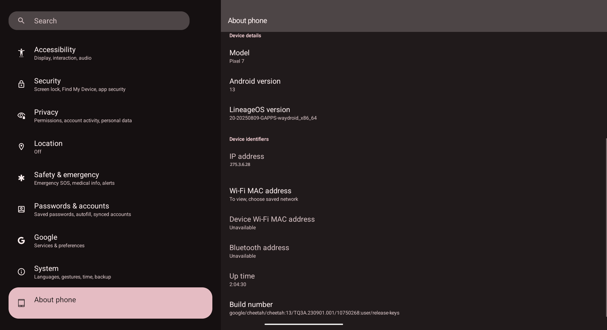
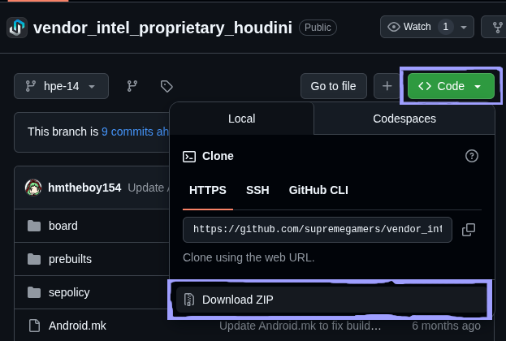

So other day I came across <a href="https://waydro.id/" target="_blank">Waydroid</a> and it felt like a dream is about to come true (but not that easily) ~ see, up until now, BlueStacks (and other emulators) been only way to run Android on Windows (and both s*ck "– ⌓ – ), but this was the game-.. life changer for me !

As the name "Waydroid" suggests (a-.. not really, but me had no idea how to start), it is a way to run not just Android apps, but full Android system on Linux. BUT-.. it only runs on "Wayland" Windowing System („• ֊ •„).. run the following command in your terminal:

```bash
echo "$XDG_SESSION_TYPE"
```

and if you don't get `wayland` as output, well-.. GOOD-BYE ~ (ˊ•͈ ◡ •͈ˋ)

You still here? If yu still here ando not on Linux at all and thinking of switching to Linux just for Waydroid or just to be able to play ブルーアーカイブ (that second one does not work ( •᷄ᴗ•́)-..), me suggest to go with latest Fedora !

Okie, if you ready.. the question is "why you want to read this blog, instead of official docs to install Waydroid?".. it does not work. I mean, the docs are very very good, and if you don't care about Google Play Store and other Google apps, you can go with the Vanilla version and me guess you will be good to go. But running G-Apps version (with Play Store and other Google related stuff), it wasn't that straight forward as it seemed, me had to install it more than 4 times (˵ ¬ᴗ¬˵), me yu- the reader-chan, I won't let you suffer the same !!! ｡°(°¯᷄◠¯᷅°)°｡

## Install Waydroid
Assuming you are on Fedora (as me), the following command is for Fedora, but if your OS is support by Waydroid, please run the command suggested by the <a href="https://docs.waydro.id/usage/install-on-desktops" target="_blank">Waydroid Docs</a>.

> Also, me saw online some suggested to install the Vanilla version and then install G-apps module using <a href="https://github.com/casualsnek/waydroid_script" target="_blank">waydroid_script</a>. DO NOT DO THAT. As of writing this, it does not work. If you want Google Play Store, select the G-Apps version in the step 2 below !

[me just copy-paste following instructions from Waydroid Docs]

1. Install Waydroid: `sudo dnf install waydroid`

2. After installing, launch Waydroid from the applications menu and proceed with the initialization by pasting these URLs in the OTA fields:
    - System OTA: `https://ota.waydro.id/system`
    - Vendor OTA: `https://ota.waydro.id/vendor`

[end of copy-paste]

## Post Installation Setup

After that initial setup completes, Waydroid should run/start immdedietly.

### Optional, Why Not ~

Okie, if you go to settings and about device, it will say something like "Waydroid_x86-64".. and if you will later login/signup with your Google account (for example), it will show the device as "Waydroid-..", which on personal level hurts (not sure about yu ~). So, why not change it to "Google Pixel" (it is called device spoofing[^1]) ??



For that purposes, we need to update the waydroid props. We will be updating `waydroid.cfg` (which is located in `/var/lib/waydroid/` directory) with custom Android properties so that the system recognize itself as "Google Pixel" phone.

> All say/suggest online to use `waydroid_base.prop` file located in `/var/lib/waydroid/`, but that file is generated/over-written everytime the Waydroid container/session restarts. What that means for this case is the device spoofing will be temporary and after restart, the device will go back to "Waydroid..".

Open terminal and run following command (notice `sudo`, i.e. you need admin privileges to edit that file):

```bash
sudo nano /var/lib/waydroid/waydroid.cfg
```

I prefer `vim` over `nano`, but me don't want you to get stuck inside `vim`-.. a-anyway! It should open the `waydroid.cfg` file. Now, paste (or if you have nothing to do, just write manually) the following **under the `[properties]` section**:

- For Google Pixel 5, use following:

```
ro.product.brand=google
ro.product.manufacturer=Google
ro.system.build.product=redfin
ro.product.name=redfin
ro.product.device=redfin
ro.product.model=Pixel 5
ro.system.build.flavor=redfin-user
ro.build.fingerprint=google/redfin/redfin:11/RQ3A.211001.001/eng.electr.20230318.111310:user/release-keys
ro.system.build.description=redfin-user 11 RQ3A.211001.001 eng.electr.20230318.111310 release-keys
ro.bootimage.build.fingerprint=google/redfin/redfin:11/RQ3A.211001.001/eng.electr.20230318.111310:user/release-keys
ro.build.display.id=google/redfin/redfin:11/RQ3A.211001.001/eng.electr.20230318.111310:user/release-keys
ro.build.tags=release-keys
ro.build.description=redfin-user 11 RQ3A.211001.001 eng.electr.20230318.111310 release-keys
ro.vendor.build.fingerprint=google/redfin/redfin:11/RQ3A.211001.001/eng.electr.20230318.111310:user/release-keys
ro.vendor.build.id=RQ3A.211001.001
ro.vendor.build.tags=release-keys
ro.vendor.build.type=user
ro.odm.build.tags=release-keys
```

--- OR ---

- For Google Pixel 7, use following:

```
ro.product.brand=google
ro.product.manufacturer=Google
ro.system.build.product=cheetah
ro.product.name=cheetah
ro.product.device=cheetah
ro.product.model=Pixel 7
ro.system.build.flavor=cheetah-user
ro.build.fingerprint=google/cheetah/cheetah:13/TQ3A.230901.001/10750268:user/release-keys
ro.system.build.description=cheetah-user 13 TQ3A.230901.001 10750268 release-keys
ro.bootimage.build.fingerprint=google/cheetah/cheetah:13/TQ3A.230901.001/10750268:user/release-keys
ro.build.display.id=google/cheetah/cheetah:13/TQ3A.230901.001/10750268:user/release-keys
ro.build.tags=release-keys
ro.build.description=cheetah-user 13 TQ3A.230901.001 10750268 release-keys
ro.vendor.build.fingerprint=google/cheetah/cheetah:13/TQ3A.230901.001/10750268:user/release-keys
ro.vendor.build.id=TQ3A.230901.001
ro.vendor.build.tags=release-keys
ro.vendor.build.type=user
ro.odm.build.tags=release-keys
ro.build.version.release=13
ro.build.version.release_or_codename=13
ro.build.version.sdk=33
ro.build.characteristics=nosdcard
```

Now press <kbd>Ctrl</kbd>+<kbd>X</kbd>, then press <kbd>Y</kbd> and finally <kbd>Enter</kbd> (aka return key) to save and exit the file. And just to make the new properties gets generated, let's stop and restart the Waydroid:

- Stop Waydroid session:

```bash
waydroid session stop
```

- Stop Waydroid container:

```bash
sudo waydroid container stop
```

- Start Waydroid container:

```bash
sudo waydroid container start
```

- Start Waydroid session by running following command or running Waydroid from the application menu:

```bash
waydroid session start
```

Phew ~ now if you go to settings and about device, hopefully you should see "Google Pixel 5" or "Google Pixel 7" based on what you chose above. And if it still says "Waydroid..", double check the steps above OR (in extreme cases), yu are welcome to curse me at this email address: <a href="mailto:haro@cheapnightbot.me">haro@cheapnightbot.me</a> (˶‾᷄ ⁻̫ ‾᷅˵)

### Google Play Certificate

Now you want to certify your Waydroid device (?), otherwise you will get warning saying something like "the device is not certified for Google Play Protect".. Google Play Store and related stuff may or may not work (not sure), but still! Doing this step is also straight forward, just follow steps here: https://docs.waydro.id/faq/google-play-certification and as suggested, I find it 5 to 10 minute wait is needed to reflect changes.

While that happens, you may want following optional things:

- **Widevine**: To be able to play/stream DRM protected content like music and movies.
- **Libndk**/**Libhoudini**: To be able to install/run arch64 and other archticture apps/games on your x86_64 system... wait- your CPU is x86_64, right? (｡﹏｡")
    - You can run `uname -m` in your terminal to check !

### Install Widevine

For installing **Widevine**, we can use <a href="https://github.com/casualsnek/waydroid_script" target="_blank">waydroid_script</a>:

- Install `lzip` as it is required by the script to work:

> This is for Fedora, but if you are not using Fedora, check the script's repository itself for instructions: <a href="https://github.com/casualsnek/waydroid_script?tab=readme-ov-file#dependencies" target="_blank">casualsnek/waydroid_script</a>. Ando at that point, you might follow the instructions to install Widevine from there as well. There is nothing special of doing that here ~

```bash
sudo dnf install lzip
```

- Clone the repository, create virtual environment, install required packages in that virtual environment:

```bash
git clone https://github.com/casualsnek/waydroid_script
cd waydroid_script
python3 -m venv venv
venv/bin/pip install -r requirements.txt
```

- Install Widevine:

> We need to use `sudo` (i.e. admin privileges) to run `main.py` as it does changes inside that same `/var/lib/waydroid/` directory, which is protected. And, instead of activating the virtual environment we created above and then running `python3 main.py..`, we directly use that python interpreter from the virtual environment.

```bash
sudo venv/bin/python3 main.py install widevine
```

After installation, it should show confirmation message and Waydroid should automatically start.

### Install Houdini

Wait-.. didn't me say "Libndk/Libhoudini" above? Yes, and you can do so by the same <a href="https://github.com/casualsnek/waydroid_script?tab=readme-ov-file#install-libndk-arm-translation" target="_blank">script mentioned above</a>, BUT-.. it does not work ~ (˵ ¬ᴗ¬˵) I mean, it does say "installed", I can see download speed going up, it does something, but has same effect of doing nothing. ( ;´ - `;)

That is why we will be installing **Houdini** manually. BUT, before we do that, please note following:

- Installing **Houdini** does **NOT** make it possible to install arch64 apps/games. Me mean, I was not able to install many apps & games due to them not supporting x86_64 architecture.
- At this point, before installing **Houdini**, try to install and run a game! You will find that:
    1. The game only shows the icon when running it. Nothing happens. OR
    2. The game crashes immedietly after opening with black screen.
- You might be tempted to do the "*Granting full permission for apps data (HACK)*" suggested/provided by <a href="https://github.com/casualsnek/waydroid_script?tab=readme-ov-file#granting-full-permission-for-apps-data-hack" target="_blank">waydroid_script</a>.. PLEASE DO NOT DO THAT FOR YOUR IMAGINARY WAIFUS SAKE ( ˶o˶˶o˶) !!

Anyway, but that's where installing **Houdini** solved these issues for me ~

> Credit: <a href="https://github.com/casualsnek/waydroid_script/issues/237#issuecomment-3106116308" target="_blank">Comment by **akku1139**</a>

- Download the following repository. Yes, DOWNLOAD.. do not clone the repository: <a href="https://github.com/supremegamers/vendor_intel_proprietary_houdini/tree/hpe-14" target="_blank">vendor_intel_proprietary_houdini</a>

- Then, somehow, unzip it (ganbatte reader-chan ৻(  •̀ ᗜ •́  ৻)) !
- Open the directory in terminal (where you unzipped the repo downloaded above) and run `pwd`, followed by `ls` commands to make sure you see something similar:
    - ```bash
        >>> pwd
        /home/reader-chan/Downloads/vendor_intel_proprietary_houdini-hpe-14
      ```

    - ```bash
        >>> ls -1
        Android.mk
        board/
        houdini.mk
        native_bridge_arm_on_x86.mk
        prebuilts/
        README.md
        sepolicy/
      ```

- Next, we need to copy the contents of `prebuilts` directory to `/var/lib/waydroid/overlay/system` !
    - If you installed the G-Apps version, most likely the `system` directory might not be there. So let's make sure to first create it if it's not already there by running following command:
    - ```bash
        sudo mkdir -p /var/lib/waydroid/overlay/system
      ```
    - Then run following command to copy the contents of `prebuilts` directory there:
    - ```bash
        sudo cp -r ./prebuilts/* /var/lib/waydroid/overlay/system/
      ```

- After that, we need to update `waydroid.cfg` file with updated props!
    - Run following command to open `waydroid.cfg` file for editing:
    - ```bash
        sudo nano /var/lib/waydroid/waydroid.cfg
      ```
    - Add the following **under the `[properties]` section** at the end:
    - ```
        ro.product.cpu.abi=x86_64
        ro.product.cpu.abilist=x86_64,x86,arm64-v8a,armeabi-v7a,armeabi
        ro.product.cpu.abilist32=x86,armeabi-v7a,armeabi
        ro.product.cpu.abilist64=x86_64,arm64-v8a

        ro.dalvik.vm.isa.arm=x86
        ro.dalvik.vm.isa.arm64=x86_64
        ro.enable.native.bridge.exec=1
        ro.dalvik.vm.native.bridge=libhoudini.so
      ```
    - Now press <kbd>Ctrl</kbd>+<kbd>X</kbd>, then press <kbd>Y</kbd> and finally <kbd>Enter</kbd> (aka return key) to save and exit the file.

Finally, just to make the new properties gets generated, let's stop and restart the Waydroid:

- Stop Waydroid session:

```bash
waydroid session stop
```

- Stop Waydroid container:

```bash
sudo waydroid container stop
```

- Start Waydroid container:

```bash
sudo waydroid container start
```

- Start Waydroid session by running following command or running Waydroid from the application menu:

```bash
waydroid session start
```

> Note: trying to run `sudo waydroid container start` OR `waydroid session start` might give you warning/errors. just look through every line under the `[properties]` section in the `/var/lib/waydroid/waydroid.cfg` and remove any duplicate lines (if any). And try to run again (AFTER SAVING THE FILE of course), the warning/errors will go away ~ ദ്ദി(•̀ ᗜ <)

***

And... that's it! If everything goes well, you'll have Android-chan under the disguise of Fedora-tan at your disposal ~ (⸝⸝> ᴗ•⸝⸝)

[^1]: Device spoofing is a technique used to disguise or alter a device’s identity by manipulating its unique identifiers, allowing it to impersonate another device or deceive systems into recognizing it as different.
